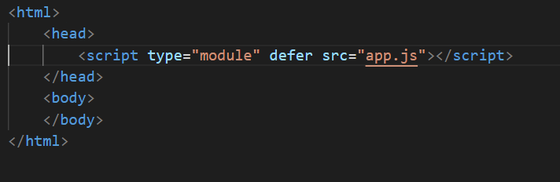
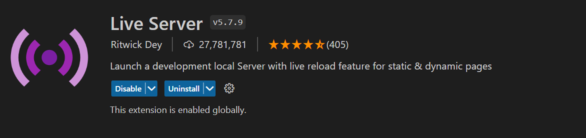
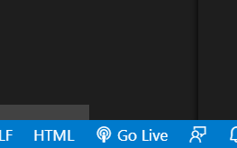
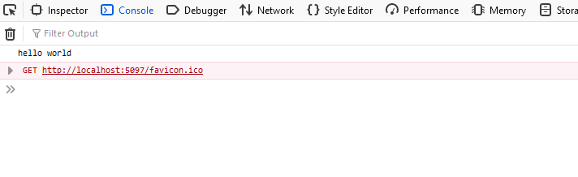

## git aanmaken

- ga naar jouw github
- maak een repository met naam `M2 prog js`

## Mappen aanmaken

- Ga naar de map waar jouw school werk in staat
- clone jouw git repository (`M2 prog js`) naar de school map directory stap 1
- git clone maakt nu een `M2 prog js` directory aan op jouw laptop
- maak nu een `01A` directory aan in `M2 prog js`  
 
- Open deze `01A` directory in visual studio code

## Javascript ontwikkel omgeving opzetten

- maak nu een file aan: `index.html`
- maak nog een file aan: `app.js`

## basis code in files zetten

- in `index.html` zet het volgende:

 

- in `app.js` zet het volgende:

 

- Lees/bedenk waar je jouw code straks moet zetten!

## live server installeren

Nu gaan we live server installeren
> In `visual studio code`, dit is een addon/extension

- open je extensions (linker menu 4 blokjes)
- zoek op live server
- installeer deze: 

 

> LET OP, als je de stap hieronder doet, krijg je een `windows firewall `melding, je mag op `annuleren` clicken
- gebruik de knop `go live` om de server te starten

 

- dat start de server en laat jouw `index.html` zien
> de pagina is nu nog `leeg`, dat is `OK`
- kijk nu eens welke opties je ziet als je met `rechter muis` op de file in de `explorer (binnen visual studio code, waar je je files ziet)` clicked

## console.log?

Waar komt de console.log?
> elke browser heeft web development tools. Zoek die van jouw browser
> als je die open hebt zal je ook een console kunnen vinden

- controlleer of je daar `hello world` ziet staan:

 

## klaar?

- commit & push je werk naar github
