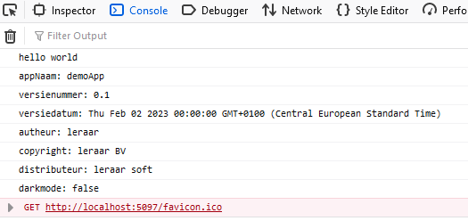

## start

- open je `app.js` in de map `01A`

## variabel opdracht:

We hebben nu een javascript begin

we gaan variabelen maken. Dat deed je zo:
`let eenVariableNaam = #waarde#`  
> - `#waarde#` kan een `string` zijn `"hello"` of andere types:  
>   - `true` 
>   - `99`
>   - andere datatypes en waardes
> - `eenVariabeleNaam` is een naam die ik gekozen heb, dat mag alles zijn zolang het `beschrijft` wat de variabel is!
> ###### voorbeeld:
> let leeftijd = 9;
> let naam = "leraar";

- Maak deze variabelen aan in de `runApplication` function (*gebruik let*):
	- appNaam (`string`)
	- versienummer (bijvoorbeeld: `0.9` `double`)
	- versiedatum (`string` of voor extra uitdaging een `Date`)
	- autheur (`string`)
	- copyright (`string`)
	- distributeur (`string`)
	- darkmode (`boolean`)
> wij hebben nu lokale variablen gemaakt
> deze verdwijnen zodra we uit de function zijn

## console.log

Nu gaan we `console.log` gebruiken:

- print met `console.log(de_naam_van_de_variable)` alle variabelen van de vorige opdracht
- Deze console.log regels gaan in je `runApplication` *onder* de variabelen
- open je developer tools van je browser
- check of alles in de debug console staat!

 

## klaar?

- commit & push je werk naar github
