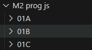
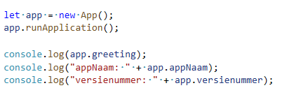
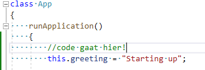
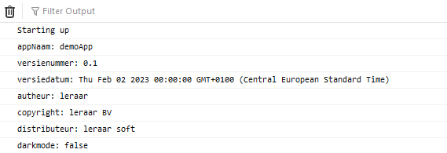

## start

## Mappen aanmaken

- Ga naar de map jouw `M2 prog js` directory op jouw laptop
- maak nu een `01B` directory aan in `M2 prog js`  
 
- Open deze `01B` directory in visual studio code
- kopieer `app.js` en `index.html` uit `01A` naar `01B`

## variabel opdracht:

We hebben nu veel variabelen in onze javascript.
Alleen die bestaan alleen in `runApplication` dat is niet super nuttig

wat wij graag willen kunnen is:
> dit is uitleg, dit hoef je nog niet te doen
 

## extra variabel maken:

Hoe krijgen we dat voor elkaar?
Laten we het voordoen door een nieuwe variabl te maken:
- type het stuk van `greeting` in je `app.js` in de function `runApplication` zoals hieronder:
 

> zie je de `this` ervoor?
> daarmee zeg je:
>  - deze variabel wil ik aan de `class` `App` geven
>     - zo wordt het een `class variable`, een eigenschap van die class
>  - `greeting` is dan niet in de function `runApplication` maar in de hele `class` beschikbaar
>  - classes zijn een soort `doos` waar code die bij elkaar hoort in zit, maar dat komt later

## En nu de rest

- zet alle `console.log` regels uit `runApplication` erbuiten zoals in het plaatje
 
- zet voor elke `console.log` regel er `app.` bij
  >  - (bv appNaam wordt app.appNaam) 
- check of je `8` regels hebt, voor elke variabel `1`

## this.

- ga naar de `runApplication` function
- vervang nu overal `let` door `this.  

## Testen

- check of alles in de debug console staat!

 

## klaar?

- commit & push je werk naar github
