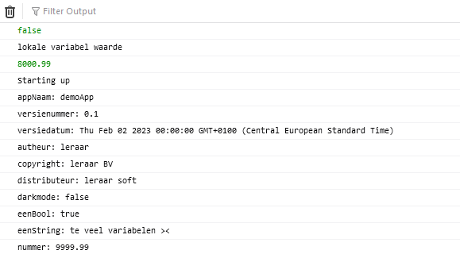

## start

## Mappen aanmaken

- Ga naar de map jouw `M2 prog js` directory op jouw laptop
- maak nu een `01C` directory aan in `M2 prog js`
 
- Open deze `01C` directory in visual studio code
- kopieer `app.js` en `index.html` uit `01B` naar `01C`

## Local variabels

Om te oefenen gaan we nog meer variabelen maken:

- maak in `runApplication` 3 nieuwe `local` variabelen aan
	- een `boolean`
	- een `string`
	- een `number` 
		> *HINT:* gebruik `let`

- `console.log` al deze variabelen  
	> *HINT:* dit moet in de function `runApplication`
	
## class variabels

- maak in `runApplication` 3 nieuwe `class` variabelen aan
	- een `boolean`
	- een `string`
	- een `number` 
		> *HINT:* gebruik `this`

- `console.log` al deze variabelen  
	> *HINT:* dit `buiten` de class, onderaan in de file

## Testen

- check of alles in de debug console staat!

 

## klaar?

- commit & push je werk naar github
