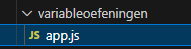
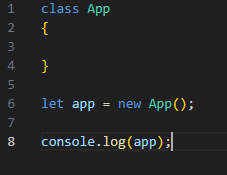
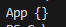

## start

- maak een nieuwe map: `variabeloefeningen`
- maak een `app.js` in die map:
 

## Opstart code maken:

- open `app.js`
- type de volgende code in `app.js`:
 

## testen

- gebruik `nodejs` om `app.js` te draaien
- dit zou je moeten zien:
 

## klaar?

- commit & push je werk naar github
