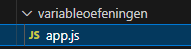
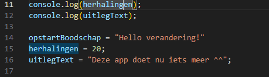
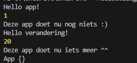
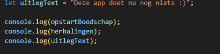
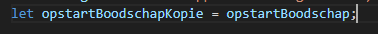
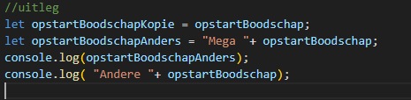
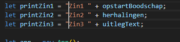
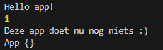

## veranderen

- open `app.js` in `variabeloefeningen`
 

## waarde veranderen

als we dingen bijhouden of onthouden in een programma, veranderen we ook vaak de waarde
> - denk aan de `position` van een `speler` of `monster` in een game
> - die veranderd heel vaak

- voeg onder je `console.log` het volgende toe:  
 
- zet daaronder weer de console.log net als daarboven

## testen

- zorg of je nu dit krijgt:  
 

## zelf veranderen

- maak nu nog `2 keer` een verandering en `console.log` dat voor:
    - `opstartBoodschap`
    - `herhalingen`
    - `uitlegText` 

## ophalen en gebruiken

Als je een waarde ophaalt kan je die ook meteen gebruiken:
- je kan het meteen doorgeven `console.log(opstartBoodschap)`
 
- je kan het in aan een nieuwe variable geven (dit wordt vaak een kopie)
 
- je kan de waarde gebruiken en aanpassen en dan doorgeven of aan een variable geven:
 

## zelf doen
- schrijf de volgende code over:  
 

- kijk naar `console.log(opstartBoodschap)`
> - `console.log()` is een `function`, waar je 1 ding aan `meegeeft` om te loggen 
> - wij halen de waarde van `opstartBoodschap` op
> - dat wordt `Hello app!` een `string`  
> - die geven we mee aan de `console.log()` function

## testen

- gebruik `nodejs` om `app.js` te draaien
- dit zou je moeten zien:  
 

## klaar?

- commit & push je werk naar github
