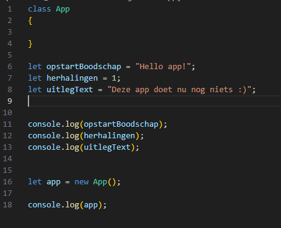
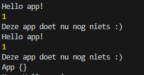
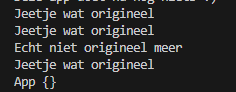
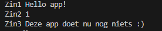

## get and use

- maak een `app2.js` in `variabeloefeningen`
- open `app2.js` in `variabeloefeningen`  
   
- haal wat code weg todat je dit krijgt:  
 

## ophalen en gebruiken

Als je een waarde ophaalt kan je die ook meteen gebruiken:
- je kan het meteen doorgeven `console.log(opstartBoodschap)`  
 
- je kan het in aan een nieuwe variable geven (dit wordt vaak een kopie)  
 
- je kan de waarde gebruiken en aanpassen en dan doorgeven of aan een variable geven:  
 

## zelf kopieen maken

- maak nu kopieen van:    
    - `opstartBoodschap`
    - `herhalingen`
    - `uitlegText` 
- `console.log` die ook

- controller of je het volgende krijgt:  
 

## veranderen?

als we de `=` gebruiken bij:
> - string
> - number (int float ...)
> - date
> - bool  

dan `kopieeren` wij de `waarde`. Als we het `origineel aanpassen ` dan blijft de `kopie onveranderd`.

## laten we dat proberen!

- schrijf de volgende code over:  
 

## testen

- gebruik `nodejs` om `app2.js` te draaien
- dit zou je moeten zien:  
 

## ophalen en gebruiken

- type de volgende code over:  
 

- kijk naar `let printZin1 = "Zin1 " + opstartBoodschap;`
> - we maken een nieuwe variable `printZin1`
> - we halen de `waarde` van `opstartBoodschap` op 
>   - dan wordt het soort van: ` let printZin1 = "Zin1 " + "Hello app!";`
> - we plakken nu waarde van `"Zin1"` aan de `waarde` van `opstartBoodschap`:
>   - "Zin1 Hello app!" resultaat van (`"Zin1 " + "Hello app!"`)
> - dan wordt `"Zin1 Hello app!"` onthouden in `printZin1`

## testen

- `console.log` nu de printZinnen (1,2 en 3)  
- gebruik `nodejs` om `app2.js` te draaien
- dit zou je moeten zien:  
 

## klaar?
- commit & push je werk naar github
