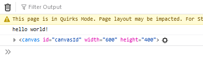

# canvas start

## Mappen aanmaken

- Ga naar waar jouw school werk staat
- Ga naar de map/directory `M2 prog js`
Uit de vorige les!
- Maak een map `02 canvashuis`
 
- Open de `02 canvashuis` folder in visual studio code

## files opzetten

- Kopieer files van de vorige les naar 
 `02 canvashuis`
    - `index.html`
    - `app.js`
- open de directory `02 canvashuis` in visual studio code  
 

## html aanpassen
- open `index.html`
- zet een canvas tag in je body:

 

> - zie je die `600` & `400`? dat is hoeveel `pixels` je hebt

## javascript opruimen

- open `app.js`
- haal de variabelen weg die je voor les 1 gemaakt had
- check of je code er zo uitziet:

 

## javascript 

- open `app.js` werk in de `function` `runApplication`
- maak een `variable` met de naam `canvas` (gebruik `let`)
- na de `=` gebruiken we `document.getElementById("...")` om het canvas uit de html te selecteren

- kijk goed naar welke `id` je op de `...` moet invullen!
 
- zet ook `console.log(canvas)` in je code onder de `let canvas`; 

## testen

- run je website met `live server`
- kijk wat je ziet in de developer tools:  
 

##  canvas gebruiken:

Om te kunnen tekenen moeten we eerst een teken object vragen
dat doen we door `let g = canvas.getContext("2d");` in onze code te zetten

- zet onder je `let canvas` de code `let g = canvas.getContext("2d");`
- nu kunnen we tekenen: `g.fillRect(0,0,10,10);`
- controlleer of je nu een zwart vierkant op je webpagina hebt  
 

## klaar?

- commit & push je werk naar github
