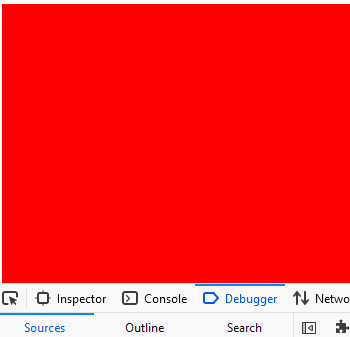
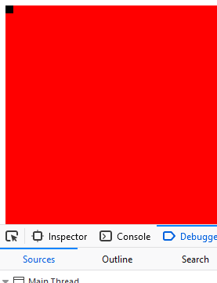

# kleuren

## achtergrond kleurtje

dit is nog wel heel erg kaal, laten we een achtergrond tekenen

- eerst zetten we de kleur goed: 
    - `g.fillStyle = "red";`
    - of je gebruikt kleur codes `g.fillStyle = "#FF0000";`
- dan tekenen we nog een rechthoek:
    - `g.fillRect(0,0,canvas.width,canvas.height);`

> wat gebeurt hier?  
> we vragen aan onze `canvas` variable hoe breedt `width` en hoe hoog die is `height`

## testen

- run je website met `live server`
- kijk wat je ziet in de developer tools:  
 

> waar is ons zwarte vierkant?

## herstellen

dit is een volgorde probleem. We moeten:
- eerst de kleur naar rood zetten
- dan het rode vierkant tekenen.
- dan de kleur naar zwart zetten
- dan het vierkant tekenen

probeer dat!

lukt het niet check de oplossing:

  
 

 

## zelf kleuren

- verander nu de kleuren

## klaar?

- commit & push je werk naar github