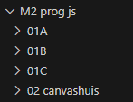

# canvas

## Mappen aanmaken

- Ga naar waar jouw school werk staat
- Ga naar de map/directory `M2 prog js`
Uit de vorige les!
- Maak een map `02 lijnen`  
 

- Kopieer files van  `02 canvashuis` naar `02 lijnen`:
    - `index.html`
    - `app.js`
- Open de `02 lijnen` folder in visual studio code

## opschonen

- haal even de rechthoek weg die hebben we nu niet nodig

## lijnen tekenen:

> - je start een Path met `beginPath()`
> - dan beweeg naar het begin punt (`20,20 in het plaatje`) met `moveTo()`.
> - dan geef je aan dat je een lijn naar een punt wil (`300,300 in het plaatje`) met `lineTo(x,y)`
> - sluit het pad met `closePath()` en teken de lijn met `stroke`
> `stroke` heeft zijn eigen kleur: `g.strokeStyle`

 
*plaatje zijn van `sjo`*

- maak deze code na en kijk of je een lijn krijgt:
 

## testen

- run je website met `live server`
- kijk wat je ziet in de developer tools:  
 

## vormen tekenen:

vormen gaan op dezelfde manier, alleen gebruik je niet `stroke` maar `fill`
> - je start een Path met `beginPath()`
> - dan beweeg naar het begin punt (`20,20 in het plaatje`) met `moveTo()`.
> - dan maak je lijnen van de vorm per punt wil (`300,300 in het plaatje`) met `lineTo(x,y)`
> - sluit het pad met `closePath()` en teken de lijn met `fill`

 

- maak deze code na:
 

## testen

- run je website met `live server`
- kijk wat je ziet in de developer tools:    
 

## stroke & fill?

Je kan ook een vorm vullen en een lijn eromheen krijgen:  
 

## klaar?

- commit & push je werk naar github
