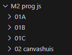
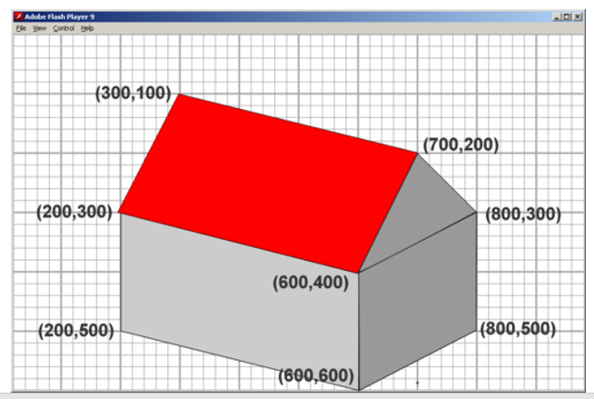
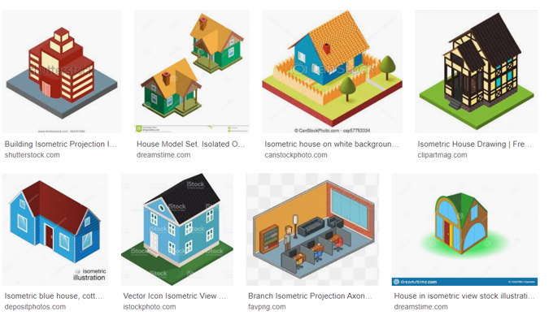

# huis

## Mappen aanmaken

- Ga naar waar jouw school werk staat
- Ga naar de map/directory `M2 prog js`
Uit de vorige les!
- Maak een map `02 huisje`  
 

- Kopieer files van  `02 canvashuis` naar `02 huisje`  :
    - `index.html`
    - `app.js`
- Open de `lijnen` folder in visual studio code

## opschonen

- haal even de rechthoek weg die hebben we nu niet nodig
- zet in `index.html` de `600` naar `1000`
- zet in `index.html` de `400` naar `1000`

## Huisje tekenen

Gebruik nu wat je hebt geprobeerd en geleerd

- maak dit huis na:
 
*plaatje zijn van `sjo`*

## kleiner
- maak deze nu kleiner zodat deze in `100` bij `100` pixels past
    - *`hint`*: maak bijvoorbeeld van `800` => `80`
- teken nu een raam (die heb je later nodig)

- dan vul dit kleinere huisje het aan met je eigen ideeen

haal inspiratie uit dit plaatje:
 
*plaatje zijn van `sjo`*

## klaar?

- commit & push je werk naar github

