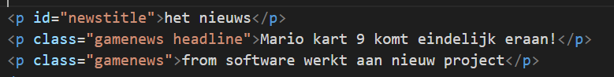

# ifelse start

## Mappen aanmaken

- Ga naar waar jouw school werk staat
- Ga naar de map/directory `M2 prog js`
- Maak een map `03 ifelse`
- Open de `03 ifelse` folder in visual studio code


## files opzetten

- Kopieer files van de `01A` directory naar `03 ifelse`
    - `index.html`
    - `app.js`

- open de directory `03 ifelse` in visual studio code

## opschonen

- zorg dat je app.js er zo uitziet:
    - je moet dus wat weghalen als je de opdrachten gemaakt hebt

</br>

## html aanpassen

- open `index.html`
- zet een de volgende tags in je body:



- bekijk de `tags` van de html hierboven
- bekijk de `presentaties van de lessen` nog eens en let op:
    - welke `2 manieren` er zijn om html tags te selecteren met `document`
- bedenk je op nu hoe je de `tags` kan `selecteren` uit de html hierboven zodat je ze in javascript kan gebruiken

- schrijf dat met commentaar in je `app.js`
    - HINT: `commentaar` begint met `//` in javascript:
        - `//dit is code commentaar voor javascript` in je `app.js`

```
    class App
    {
        runApplication()
        {
            //hier komt je code
            //dit is code commentaar voor javascript
            //dit is ook commentaar
        }
    }
```


## klaar?

- commit & push je werk naar github

