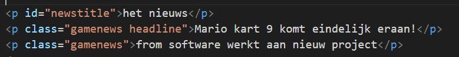
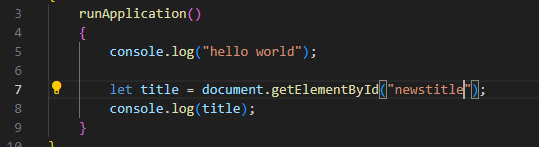
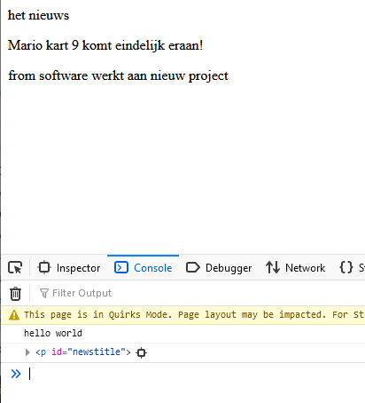
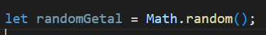
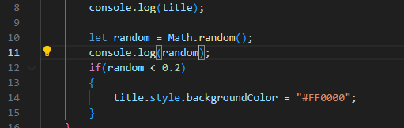
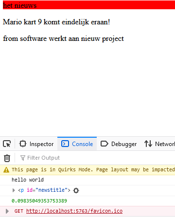
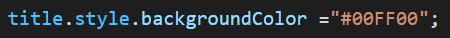
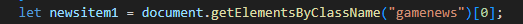
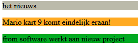

# selecteren

## html check
- open `index.html` in `03 ifelse`
- daar staat als het goed is de volgende regels in:

## javascript 

- open `app.js` in `03 ifelse`
- maak een `variable` met de naam `title` in `runApplication`
    - gebruik `let`
- gebruik de `document.getElementById("newstitle")` om voor deze variabel de tag op te halen
- `console.log` nu `title`
 

## testen

- run je website met `live server`
- kijk wat je ziet in je `browser` en de `developer tools`:  
 

## random kleurtje

> - we gaan nu een random introduceren:
> 
> - [zie ook w3schools random](https://www.w3schools.com/JS/js_random.asp)

- type de volgende code over:  
 

## testen

- run je website met `live server`
- als het goed is krijg je soms (reload de pagina) dit te zien:  
 

##  if else gebruiken:

Grotere if:
de random geeft een getal van `0.0-0.999999...` terug.
wij delen deze in 4 gebieden op:
> - kleiner dan 0.2
> - van 0.2 tot en met 0.6
> - van 0.2 tot en met 0.75
> - groter dan 0.75

- gebruik de `if, else if en else` om te kijken of `randomGetal` in 1 van deze gebieden zit
- per gebied geef je een andere achtergrond kleur aan de title

> TIP zoek zelf even op het internet hoe je kleuren in html zet

## testen

- run je website met `live server`
- als het goed is krijg je verschillende kleuren

## andere tags selecteren

Dit was onze html:
 

> - We gaan werken met `document.getElementsByClassName`
> - uit `document.getElementsByClassName` komen `0` of `meer` html tags  (als `array`)
> - Dus `getElementsByClassName` vindt `alle` html tags die een `classname` heeft 
>   - als we `gamenews` zoeken krijgen we 2
>   - als we `headline` zoeken krijgen we 1
>   - zoeken we `nopedezeniet` krijgen we 0

## Doen!

we gaan nu de `gamenews` tags ook een andere achtergrond kleur geven

- maak 2 nieuwe variabelen:
    - `newsitem1`
    - `newsitem2`
- gebruik:
    > - `document.getElementsByClassName("gamenews")[0]` 
    - om de `mario kart` paragraaf te selecteren
        - stop deze in `newsitem1`
    > - `document.getElementsByClassName("gamenews")[1]` 
    - om de `from software` paragraaf te selecteren
        - stop deze in `newsitem2`
     

>    

## kleuren

> TIP gebruik wat je gedaan hebt bij `title`
- maak voor `newsitem1` en `newsitem2`:
    - een `if` en `else`
    - in de `if` en `else` geef je een andere kleur aan de achtergrond
  
## testen

- run je website met `live server`
- als het goed is krijg je soms (reload de pagina) kleurtjes:  
 

## klaar?

- commit & push je werk naar github

