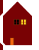
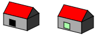

# huisje

## Mappen aanmaken

- Ga naar waar jouw school werk staat
- Ga naar de map/directory `M2 prog js`
- Maak een map `03 ifelse huisje`
- Open de `03 ifelse huisje` folder in visual studio code

## files opzetten

- Kopieer files van de `02 huisje` directory naar `03 ifelse huisje`
    - `index.html`
    - `app.js`

- open de directory `03 ifelse` in visual studio code

## Is er iemand thuis?

We gaat nu je huisje aanpassen
- zorg dat je een aantal ramen hebt.
- gebruik `random` om en getal te maken van 0 tot 1  
> 
- test met een `if else` of je het raam met licht aan of uit moet tekenen
    - TIP: verander de `fillStyle`

## testen

- run je website met `live server`
- als het goed is krijg een huis met lichten die aan en uit gaan:  
 
 

## klaar?

- commit & push je werk naar github
