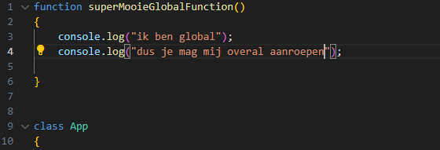
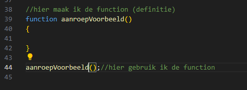
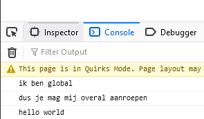
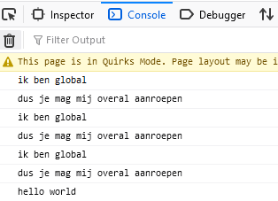

## Mappen aanmaken

- Ga naar waar jouw school werk staat
- Ga naar de map/directory `M2 prog js`
- Maak een map `04 functions`
- Open de `04 functions` folder in visual studio code

## files opzetten

- Kopieer files van de `01A` directory naar `04 functions`
    - `index.html`
    - `app.js`

## opschonen

- zorg dat je app.js er zo uitziet:
    - je moet dus wat weghalen als je de opdrachten gemaakt hebt

 

## function

Net als we eerst in Periode 1 deden.

- type de volgende code over:

 

## aanroepen (Call)

hoe roepen we deze nieuwe `function` nu aan?
- kijk naar deze code:

 

> - zie je dat de `aanroepVoorbeeld` haakjes heeft? 
> - Zie je dat er niets voorstaat?
> - Wat we hier zeggen is: zoek een `function` met de naam `aanroepVoorbeeld` en roep die aan `()`

-  zet nu onder je `superMooieGlobalFunction` de volgende regel:
    - `superMooieGlobalFunction();`

## testen

- run je website met `live server`
- als het goed is krijg een het volgende in je debugger:  
 

## vaker aanroepen (Call)

> - een function mag je meer dan 1 keer gebruiken

laten we dat proberen:
- zet onder `superMooieGlobalFunction();` nog twee keer :
    - `superMooieGlobalFunction();`

- zet onder `console.log("hello world");` in `runApplication`:
    - `superMooieGlobalFunction();`

## testen

- run je website met `live server`
- als het goed is krijg een het volgende in je debugger:  
 

> - zie je hoe we nu `hetzelfde zovaak` als we willen kunnen `herhalen`?
> - met alleen de `function call`?

## klaar?

- commit & push je werk naar github
