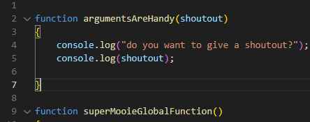
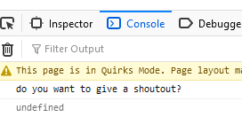
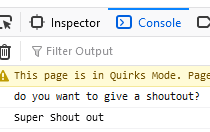
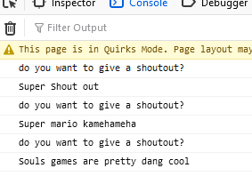

# Met argumenten

Net als we eerst in Periode 1 deden.

- type de volgende code over:

 

## aanroepen (Call)

hoe roepen we deze nieuwe `function` nu aan?

> - net als `superMooieGlobalFunction();`
> - alleen moet er iets tussen de `()`!
> - en dat komt dan in `shoutout` in de `function`

-  zet nu onder je `argumentsAreHandy` de volgende regel:
    - `argumentsAreHandy();`

## testen

- run je website met `live server`
- als het goed is krijg een het volgende in je debugger:  
 

> - wat gebeurt hier nu?
> - omdat er niets tussen de `()` staat bij het aanroepen gaat het mis
> - `shoutout` is niet meegegeven en wordt dan `undefined`

- pas het aan:
    - `argumentsAreHandy("Super Shout out");`
- test nog een keer!
- als het goed is krijg een het volgende in je debugger:  
 

## herhalen maar dan iets anders

Nu hebben we een function met argumenten
> - argumenten kunnen elke keer anders zijn
> - dus we kunnen herhalen maar dan met andere `input`
> - dit kan handig zijn!

- zet het volgende nog 2 keer in je code:
    - `argumentsAreHandy("Super Shout out");`
- verander de boodschap `Super shout out` naar iets anders (`hou het netjes!`)

## testen

- run je website met `live server`
- als het goed is krijg je 3 keer de boodschap:  
 

## klaar?

- commit & push je werk naar github
