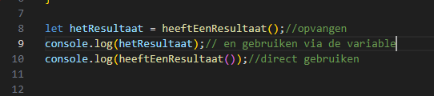

# return

het resultaat van een function. Laten we dat nogmaals gaan oefenen

## return function 

- type de volgende code over:  
 

> - zie je dat we een resultaat maken?
> - dat is gewoon een ``variabel`` die in de function bestaat
> - met de `return` kunnen we een variable teruggeven.
> - dat doen we dan ook!

## aanroepen + opvangen

laten we eerst eens de function aanroepen:
> - de function heeft geen argumenten dus de haakjes blijven leeg `()`

 

- test, zie je iets gebeuren?
> - er gebeurt niets? hoe komt dat?
> - de `function` doet iets en levert een resultaat met de `return`
> - maar het resultaat verdwijnt, want de code:
>   - doet er `niets` mee
>   - en `vangt` het resultaat `niet` in een `variable` 

## return variable opvangen

als je een bal gooit maar niemand vangt...

- verander je code naar:
 

- test? zie je nu dit?
 

## berekeningen

Laten we nu van een stuk code een function maken:

- neem deze code over:
 

- test!
 

> deze code is al variabel (we kunnen makkelijk de `x, a,b en c` aanpassen)  
> als we deze berekening vaker moeten doen wat doen we dan?
> We zetten het in een function

## in een function zetten

> eerst even kijken:
> - x, a, b en c zijn variablen
>   - dat worden dus argumenten van de function (Want die kunnen veranderen)
>   - de berekening `(a*(x*x) )+ (b*x) +c;` is wat de function gaat doen
>   - `y` is het resultaat, dat willen we dan UIT de function kunnen halen
>       - dat wordt dus `return y;`

- maak een nieuwe function:
    - met de naam `ax2bcWiskunde`
    - met 4 argumenten:
        - `x`
        - `a`
        - `b`
        - `c`
    - laat `y` returnen

> te moeilijk? kijk in de oplossing!
> 

> 
>  
> 

## calling

who you gonna call?
> de function natuurlijk >,<

- neem de volgende code over:  
 

- test! zie je dit:
 

## zelf maken

nog een berekingen:
 

- maak daar een function van net als boven
- test met de volgende code:
 

## klaar?

- commit & push je werk naar github