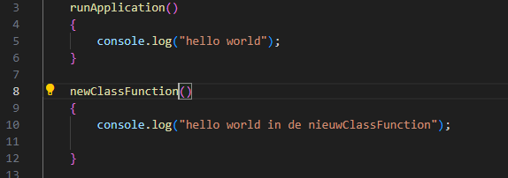
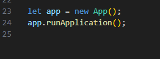
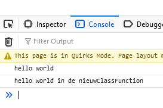
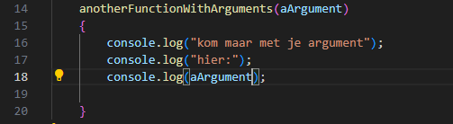
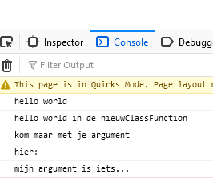

# class functions

Nu hebben we functions buiten onze class gemaakt, maar we kunnen ze ook onderdeel van de class maken.

## functions

we gaan even oefenen met class functions
- open je `app.js`
- type de `newClassFunction` code over  in je `app.js`:
 

## aanroepen

hoe roepen we deze nu aan?
- kijk naar deze code (die heb jij ook):

 

> - zie je dat de `runApplication` haakjes heeft? 
> - Zie je dat er `app.` voorstaat?
> - Wat we hier zeggen is: zoek op  `app` een `function` met de naam `runApplication` en roep die aan `()`

- kopieer de regel `app.runApplication();`
- verander `runApplication` naar `newClassFunction`

## testen

- run je website met `live server`
- als het goed is krijg een het volgende in je debugger:  
 

## functions

we gaan even oefenen
- open je `app.js`
- type de volgende code over (onder `newClassFunction` in de `class App`):
 

## aanroepen

> - deze function heeft een argument
> - dat betekent dat er `iets` tussen de `haakjes` moet, als we `aanroepen`

- kopieer de regel `app.runApplication();`
- verander `runApplication` naar `anotherFunctionWithArguments`
- zet nu tussen de haakjes `()` het volgende:
    - `"mijn argument is iets..."`
    
## testen

- run je website met `live server`
- als het goed is krijg een het volgende in je debugger:  
 

## klaar?

- commit & push je werk naar github
