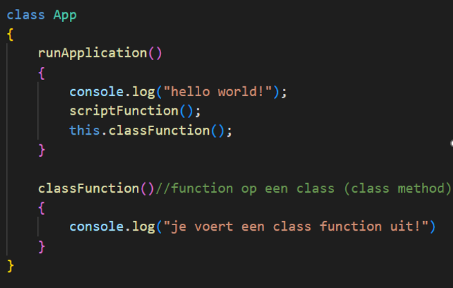

# Opdrachten Functions

## javascript 

- open `app.js`
- maak nu verschillende `functions` aan in je `class`:

- een function die `"MARIO!!"` naar de console print 
    - deze heeft geen `argumenten` 
    - deze heeft geen `return`
- een function die `"BWAHAHA!!!"` returned
    - deze heeft geen `argumenten` 
    - deze heeft wel een `return`
- een function die 2 getallen bij elkaar optelt en returned:
    - 2 getallen als `argumenten`
    - deze heeft wel een `return`
- verzin er zelf nog 1 bij

> Tip zie dit plaatje als voorbeeld waar `classFunction` een nieuwe function is
> 
> *Zet `geen` functions in functions*

## aanroepen van buiten de class:

> TIP denk aan:
>  

- roep nu elke functions aan in onder `app.runApplication();`
- voor de `return` functions vang het resulaat in een `variabel` en `console.log` die `variabel`
    - denk aan `let`!
- controller je resultaat in de developer console

## aanroepen

- roep nu elke functions aan in `runApplication`
- voor de `return` functions vang het resulaat in een `variabel` en `console.log` die `variabel`
    - denk aan `let`!
- controller je resultaat in de developer console

> - TIP: vergeet `this.` niet!
> - Als je in een `class` een `function` van die `class` wil aanroepen MOET er `this.` voor in javascript

## klaar?

- commit & push je werk naar github
