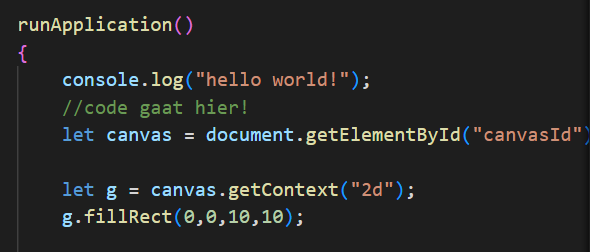
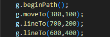
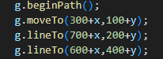
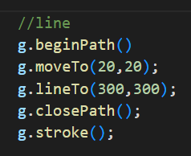
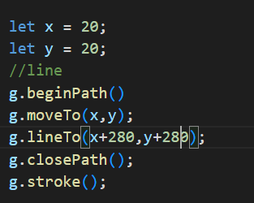
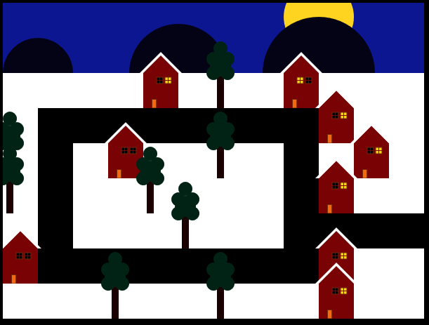
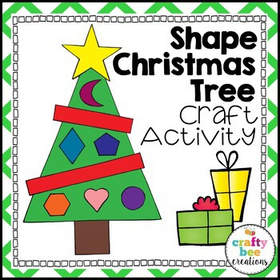
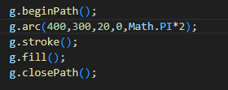
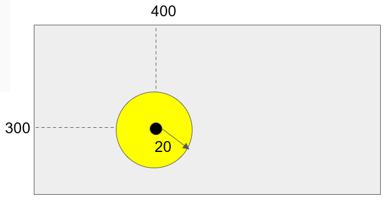

# Opdrachten Functions

## start

- Ga naar waar jouw school werk staat
- Ga naar de map/directory `M2 prog js`
- maak een map `04 canvasfunc`
- kopieer uit `02 huisje` de files naar `04 canvasfunc`:
    - `index.html`
    - `app.js`
- open `04 canvasfunc` in visual studio code

## huisje

We gaan nu onze huis teken code in een `aparte function` zetten

Zie je de `let g` daar? die bestaat `alleen` in `runApplication`
> dit noemen we een `locale variable`, die alleen:
>   - binnen de scope van de `function` bestaat
>   - Dat is de body `{}` van de `function`

`g` moeten we als argument doorgeven!

- maak een nieuwe `function`:
    - met de naam `tekenHuis`
    - in je `App` class
    - geef de `function` 1 argument `g` (zonder let!)
- verhuis (`knip`) je huis teken code naar deze nieuwe `function` (`plak`)
- roep de `function` aan in je `runApplication`:
    - vergeet `this.` niet!
    - vergeet niet `g` tussen de haken te zetten `(g)` bij de aanroep

## verplekken

Je kan je huis nu elke keer op dezelfde plek tekenen
dat is niet super handig
Dat gaan we aanpassen!

- geef je `tekenHuis function` 2 extra `argumenten`:
    - `x`
    - `y`
- gebruik die `x` & `y` in je `g.draw...` stukken in je code:
>  wordt dan:  

- roep je `tekenHuis function` nu 2 keer aan met verschillende `x` & `y`

> voorbeeld:
> hier is de lijn altijd op 1 plek  
>   
> hier niet, als je de x, y veranderd verplaatst de lijn.  
>   
> bv hier een stad met bomen & huizen in functies  
>   

## boompje?

Een huis moet ook een kerstboom hebben in deze tijd

- maak een nieuwe `function` met de naam `tekenKerstBoom` in je `App` class
- geef de `function` 3 argumenten `g`, `x` en `y`
- roep de `function` aan in je `runApplication` (vergeet `this.` niet!)
- vul de function in zodat deze een boom gaat teken:

    - De boom heeft `geen vaste plek`, gebruik `x` en `y` bij het tekenen 
    - De boom heeft `minimaal`:
        - `1` stam
        - een groen body, bv met driehoek(en)
        - `10` ballen of sterren
        - `1` piek.
    - Je mag de boom uiteraard aanvullen met allerlei extra’s zoals slingers, kaarsjes , zuurstokken , kado’s, kinderen , katten    etc…
    - Maak vooral iets wat je zelf leuk vind om te tekenen.

> Voor de kerstball kijk hier voor hoe je dat kan doen:  
>   
> Hier zie je het resultaat en hoe het werkt:  
>   
> of in de documentatie: [circle tekenen](https://www.w3schools.com/html/html5_canvas.asp)

## Extra!

Verander de `function` voor de boom zo dat je:
- het `aantal kerstballen` kan doorgeven als `argument`.
- maak het zo dat de kerstballen random in de boom gehangen worden. 
- de kleuren random zijn

- teken nog andere kerst dingen in je dorpje!

## klaar?

- commit & push je werk naar github
