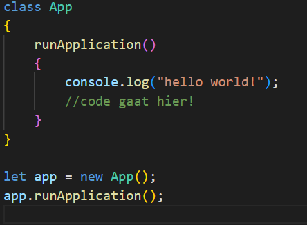
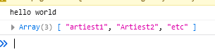
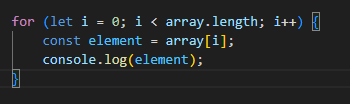
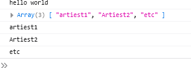
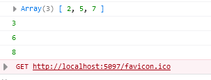
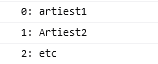

## Mappen aanmaken

- Ga naar waar jouw school werk staat
- Ga naar de map/directory `M2 prog js`
- Maak een map `05 arrays`
- Open de `05 arrays` folder in visual studio code

## files opzetten

- Kopieer files van de `01A` directory naar `05 arrays`
    - `index.html`
    - `app.js`

## opschonen

- zorg dat je app.js er zo uitziet:
    - je moet dus wat weghalen als je de opdrachten gemaakt hebt

 

## Maak een array

Een array is ook een datatype voor een variabele. Het is een lijst met allemaal waardes. Maak een array met jouw favoriete muziek artiesten. Bijvoorbeeld: 

 

- open `app.js`
- Maak jouw eigen array met favoriete artiesten
    - zet deze in `runApplication`
- print de array uit
    - gebruik `console.log`

## test 

- controlleer je werk:
 

## met een for loopen

als we 1 stuk code voor elk ding in een array willen doen gebruiken we een loop:
 

- gebruik de code hierboven om over je artiesten heen te loopen
- nu zie je elke artiest op 1 regel:

 

## nog een array

- maak nu een `nieuwe` array met getallen:
    - noem deze `nummers`
    - bijvoorbeeld met de getallen 2,5,7
- gebruik `console.log` om `nummers` te laten zien

## for elke stap

- maak een `for` loop die over `nummers` heen loopt
- in de `for` dus tussen de `{}` doe je voor elke stap:
    - tel 1 op bij het nummer
    - schrijf die uitkomst naar de console

bijvoorbeeld voor 2,5,7 zie je dan:
 

## rangnummers

je hebt je artiesten:
 

nu willen we er rangnummers voor:

- doe dit door `i` bij de artiest string op te tellen
    -`i + ": "+ element`

 

## klaar?

- commit & push je werk naar github
