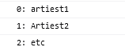

## Mappen aanmaken

- Ga naar waar jouw school werk staat
- Ga naar de map/directory `M2 prog js`
- Open de `05 arrays` folder in visual studio code

## meer artiesten

je hebt je artiesten:
 

nu gaan we met `push` toevoegen
> in andere talen kan toevoegen ook wel eens `add` heten
- voeg `NA` het laten zien van de `array` met artiesten deze 2 artiesten toe:
    - bob dylan
    - prince
    - bijvoorbeeld: `array.push("...")`
- print nu de hele array weer met `console.log` en een `for` loop naar de console:
 

##  verwijderen

bob dylan en prince? echt waar? laten we daar eens wat anders van maken.

> verwijderen uit een array in javascript doen we zo:
> 1. we zoeken de `index` op met `let indexToRemove = array.indexOf("bob dylan")`
> 2. we gebruiken `splice` om vanaf die `index` 1 element weg te halen:
>       - `array.splice(indexToRemove,1)`

- verwijder nu `bob dylan` uit de array
    - gebruik de code hierboven
- haal ook `prince` weg
- voeg nu 2 artiesten toe naar jou keuze
- `console.log` alles

 
## klaar?

- commit & push je werk naar github
