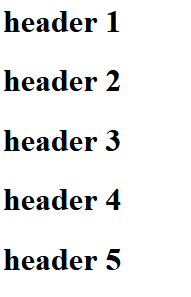
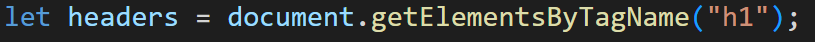
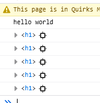
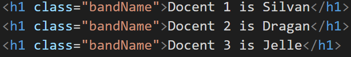
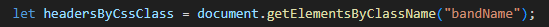
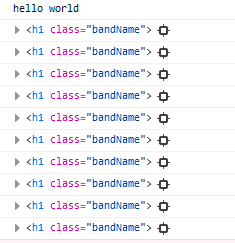
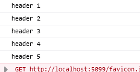
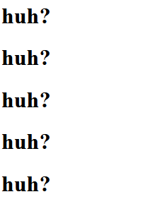

## HTML headers

We gaan nu wat html elementen toevoegen aan `index.html`:

- open `index.html`
- maak 5 headers in je html:
    - `<h1>...</h1>`
- verander de `...` naar je favoriete games/series etc
- open je `index.html` en controlleer of je iets ziet zoals dit:

</br>


## html naar javascript halen

Met javascript kunnen we `html elementen` opvragen. Als we die hebben kunnen we met code daar wat mee doen. 

Het opvragen kan op meerdere manieren

### manier A op element naam

In het HTML bestand gaan we alle h1 tags pakken. 
> !!! Dit is geen nette manier van werken, want wanneer je meer content en headers kan je misschien teveel opvragen. *`Weet dat deze manier bestaat`*

</br>

> in de variable `headers` komt nu een `array` waarin alle `h1 html elementen` van het `html document` zitten

- zet die code in je `runApplication`
- gebruik een `for` loop om alle elementen in `headers` te loggen:

</br>


### manier B op class of id 

> `*De goede manier*`

- open `index.html`
- voeg voor elke `h1` het class attribute toe:

- pak al deze headers met deze class naam.

- gebruik een `for` loop om alle elementen in `headers` te loggen:
</br>

> zelfde resultaat maar we kunnen meer controle uitoefenen over wat we selecteren


## Inhoud van de headers 

> Html elementen hebben een `.innerText` property waar je de tekst van het > element mee kan zetten:
> 
> als we HTML hebben:
> ```
> <h1 id="headerId">super text</h1>
> ```
> 
> en javascript:
> ```js
> let mijnH1 = document.getElementById("headerId")
> console.log(mijnH1.innerText);// geef weer wat de text is van mijnH1
> ```
> dan krijg je `super text` in de console te zien


- gebruik een `for` loop om door je `headerByCssClass` array te gaan
- `console.log` van `alle` elementen de `innerText`
</br>


## inhoud veranderen

> 
> als we HTML hebben:
> ```
> <h1>super text</h1>
> ```
> 
> en javascript:
> ```js
> mijnH1.innerText = "Nieuwe text";// stop een nieuwe text in de html
> ```
> dan krijg je `<h1>Nieuwe text</h1>` in de je browser te zien

- gebruik een `for` loop om door je `headersByCssClass` array te gaan
- verander de `innerText` van alle elementen naar `huh????`
</br>


## Nu nuttiger

`huh?` is niet nuttig, laten we een eerste stap richting iets beters doen:

Om alle headers aan te passen gaan we 1 voor 1 door de headers heen en passen deze aan. Dit kunnen we handmatig doen.
```js
headersByCssClass[0].innerText = "nieuws ";
headersByCssClass[1].innerText = "reviews";
headersByCssClass[2].innerText = "commentaar ";
```

- neem de code hierboven over
- verander ook nog de laatste twee headers:
</br>

## klaar?

- commit & push je werk naar github
