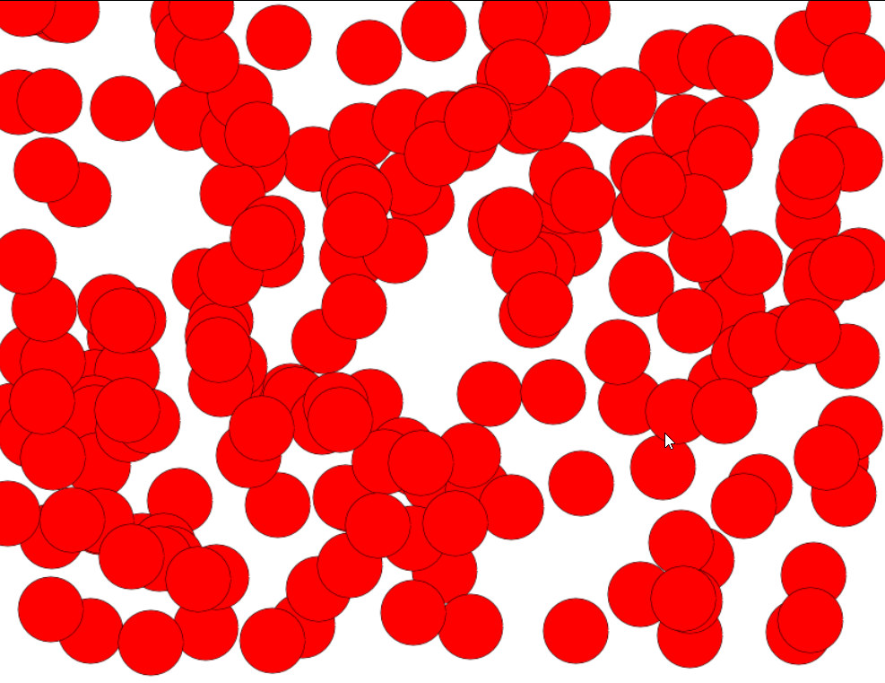
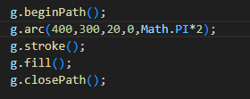

## Mappen aanmaken

- Ga naar waar jouw school werk staat
- Ga naar de map/directory `M2 prog js`
- Maak een map `05 veel tekenen`  
 

- Kopieer files van  `02 canvashuis` naar 05 veel tekenen`  :
    - `index.html`
    - `app.js`
- Open de `05 veel tekenen` folder in visual studio code

## opschonen

- haal even de rechthoek weg die hebben we nu niet nodig

- Ga naar waar jouw school werk staat
- Ga naar de map/directory `M2 prog js`
- Maak een map `05 arrays`
- Open de `05 arrays` folder in visual studio code

# (Veel) Cirkels tekenen

We gaan de canvas vullen met 200 cirkels op willekeurige plekken. Het eindresultaat komt er ongeveer zo uit te zien: 

## Teken cirkel functie

- Maak een functie:
    - genaamd `tekenCirkel`. 
    - Laat deze functie een cirkel tekenen wanneer deze aangeroepen wordt.
    - als argumenten heeft deze function:
        - g *(het teken object)*
        - x *(x positie van de cirkel)*
        - y *(y positie van de cirkel)*

Hoe je een cirkel tekent ?
>   

## For loop

- Maak een *for loop* die `200` keer iets uit voert.
- Roep hier in de `tekenCirkel` functie aan. \
- Geef voor de `x` en de `y` waardes `willekeurige` getallen mee. (`Math.random`)

> vergeet je `this.` niet voor je `tekenCirkel`

## Extra:

Kijk of je misschien ook de grootte van de cirkels of de kleur van de cirkels willekeurig kan maken.

# Klaar?
Commit en push je werk naar github
