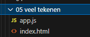

## Veel data in beeld

- Ga naar waar jouw school werk staat
- Ga naar de map/directory `M2 prog js`
- Maak een map `06 extra`  
</br>

- Kopieer files van  `04 functions` naar `06 extra`  :
    - `index.html`
    - `app.js`
- Open de `06 extra` folder in visual studio code

## opschonen

- haal even de rechthoek weg die hebben we nu niet nodig

- Ga naar waar jouw school werk staat
- Ga naar de map/directory `M2 prog js`
- Maak een map `06 extra`
- Open de `06 extra` folder in visual studio code

# (Veel) Data toevoegen

We gaan de canvas vullen met verschillende data op willekeurige plekken, afhankelijk gegevens uit een array. 

## Maak een array

- maak een multidimensionale array aan met de volgende elementen:
    - welk item wil je maken
    - welke kleur krijgt het element
    - hoe groot moet deze worden, op basis van een vergrotings factor

bv:
```
let items = [ ['boom', 'red', 1.2], ['huis', 'yellow', 0.8] ]; 
```

## Pas de array aan
- Voeg 3 elementen toe aan de array door gebruik te maken van code ( array.push() )
- Verwijder 1 element uit de array door gebruik te maken van code ( array.splice ) )


## Geef de items weer

Loop nu door deze array met sub arrays heen en plaats  de aangegeven objecten.


# Klaar?
Commit en push je werk naar github
