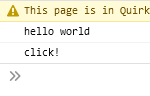

## Mappen aanmaken

- Ga naar waar jouw school werk staat
- Ga naar de map/directory `M2 prog js`
- Maak een map `06 events`
- Open de `06 events` folder in visual studio code

## files opzetten

- Kopieer files van de `01A` directory naar `06 events`
    - `index.html`
    - `app.js`

## opschonen

- zorg dat je app.js er zo uitziet:
    - je moet dus wat weghalen als je de opdrachten gemaakt hebt

 

## HTML clicks

In deze opdracht gaan we een button functionaliteit geven. Wanneer er op de knop wordt gedrukt komt er text op de pagina.

- open `index.html`
- zet in de `body` een button:
 

- Geef deze button een attribute:
    - naam: `id`
    - waarde: `myButton`

## Javascript

We gaan nu ervoor zorgen dat we code kunnen uitvoeren als er op de knop geclicked wordt.
> - hiervoor moeten we eerst de knop in javascript opvragen
> - daarna moeten we een `click event` koppelen
> - en als laatst moeten we dan als de `event` afgaat onze code uitvoeren

- werk in de function `runApplication`
- maak een variabel met de naam `uiButton`
- haal de button op
    - maak hierbij gebruik van `document.getElementById()`
- zet het resultaat van `document.getElementById()` in de variabel `uiButton`

## Event koppelen

- neem de code hieronder over:
 
> hier zien we dat we een function in een variable zetten
> en daarna doorgeven als argument aan addEventListener
- open je index.html in je browser
    - click op de knop
    - zie je dit verschijnen in je developer console?:
 

# Klaar?
Commit en push je werk naar github

