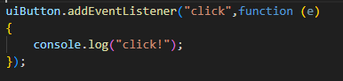
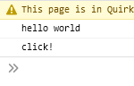

## function kleiner schrijven

Omdat javascript wat rare scoping heeft willen we de function anders schrijven

dat gaan we in stappen doen.

> we gaan eerst de lokale function direct als argument zetten:
- verander je code zodat het er zo uitziet:

 

- test het nogmaals, nu zou je hetzelfde moeten krijgen:
 

## korte versie

Nu gaan we een speciale notatie gebruiken. 
> gebruik deze altijd met `addEventListener` dat scheelt later problemen

- verander je code zodat het er zo uitziet:

 

- test het nogmaals, nu zou je weer hetzelfde moeten krijgen:
 

# Klaar?
Commit en push je werk naar github
