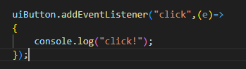
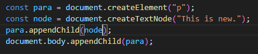
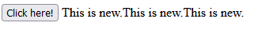
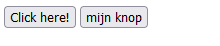
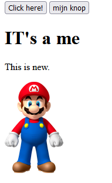
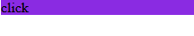
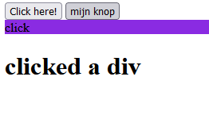

## Html toevoegen na een click

we hebben nu onze function die afgaat na een click:

- test het nogmaals, nu zou je weer hetzelfde moeten krijgen:

 

- vervang de `console.log` regel met het onderstaande:
 

- test de knop:
 

Wanneer er op de knop gedrukt wordt, wordt er nu een nieuwe paragraaf met tekst aangemaakt.
> Maak gebruik van [deze methode om in javascript HTML inhoud te maken](https://www.w3schools.com/js/js_htmldom_nodes.asp)

## zelf doen

- voeg een extra knop toe aan je html:
 

- voeg nu nog meer elementen toe:
    1. een header (`h1`)
    2. dan een paragraaf (`p`) met eigen tekst
    3. een `img` met een plaatje naar keuze van een favoriet character (wel netjes)

> *Voorbeeld*
>  

## ander click element

- in je `index.html`
- Maak nu een `div` aan in je html
- geef deze een achtergrond kleur
- zet een text in de div  
 

- maak deze nu ook clickbaar net als de knoppen
 

## Extra: Knoppen

In plaats van een stuk tekst toe te voegen, voeg een knop toe. Wanneer je op de knop drukt, komt er een nieuwe knop.

# Klaar?
Commit en push je werk naar github
