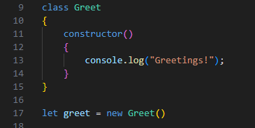
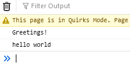
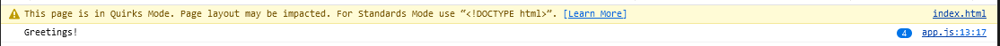
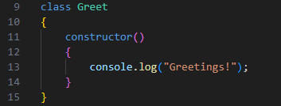
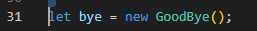
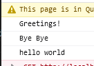

## Mappen aanmaken

- Ga naar waar jouw school werk staat
- Ga naar de map/directory `M2 prog js`
- Maak een map `07 classes`
- Open de `07 classes` folder in visual studio code

## files opzetten

- Kopieer files van de `01A` directory naar `07 classes`
    - `index.html`
    - `app.js`

## opschonen

- zorg dat je app.js er zo uitziet:
    - je moet dus wat weghalen als je de opdrachten gemaakt hebt

 

## Greet class

We gaan nu een Greet class maken en die gebruiken
- neem de code hieronder over in je `app.js`
 

- test je code en kijk of je dit krijgt:
 

## Meer greets?

- zet nu 3 keer `new Greet();` in je `app.js`

- test je code en kijk of je dit krijgt:
 

> zie je die `(4)` daar in de console?  
> soms groepeert de console dezelfde boodschappen

## GoodBye

We maken een nieuwe class:

- kopieer de `Greet` class
 

- vervang `Greet` door `GoodBye`
- vervang `Greetings!` door `Bye Bye`

> nu hebben we een nieuwe class, die net wat anders doet

Laten we die nu gaan gebruiken:
- kijk goed naar het `let greet = new Greet()` patroon
> zie je dat we een variable maken met de naam `greet` en die een waarde geven `=` en daar `new Greet()` achter zetten?  
> dat is het patroon wat we gaan gebruiken 

- neem nu de code over:
 

- test je code en kijk of je dit krijgt:
 

# Klaar?
Commit en push je werk naar github

