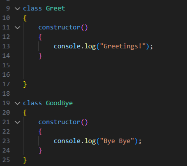
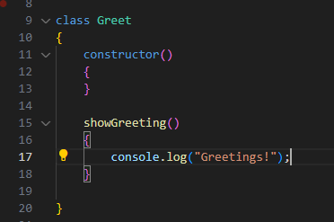
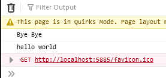
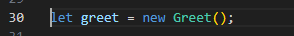
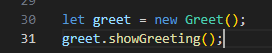
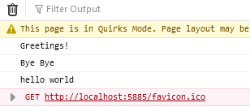
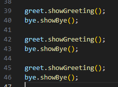
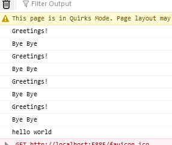

## Greet  & GoodBye class

we hebben onze `Greet` & `GoodBye` class:
 

## Constructor

> Onze `console.log` code staat nu in de `constructor`. Voor elke keer dat we `Greetings!` willen hebben moeten we `new Greet()` schrijven. Dat is niet handig.
> Laten we dit netter maken met functions
> - de `constructor` gaat maar `1` keer af
> - voor elke `new` van een `class` 
> *Dus voor elke `new Greet()` gaat de `constructor` van `Greet` __1__ keer af*

- verander je `Greet` class naar:
 

- test je code en kijk of je dit krijgt:
 

> waar is de greeting nu?
> - omdat we de greeting in een function van de class gezet hebben gebeurt er niets
> - straks gaan we de function gebruiken

## opruimen

- haal de 3 keer `new Greet()` weg
- controlleer of je alleen nog het volgende hebt:
 

## class function gebruiken

- maak nu dit in je code:
 

- test je code en kijk of je dit krijgt:
 

## GoodBye

- Doe hetzelfde voor de `GoodBye` class
    - noem de function niet `showGreeting` maar `showBye`

- test je code en kijk of je dit krijgt:
 

## herhalen

nu kunnen we gaan herhalen:
- zet nu het volgende in je code:
 

- test je code en kijk of je dit krijgt:
 

> zie je dat we nu maar 1 keer `new` gebruikt hebben?
> en de function nu een `x` aantal keer gebruiken? (zovaak we willen/nodig hebben)

# Klaar?
Commit en push je werk naar github

