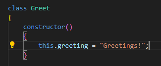
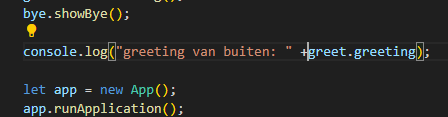
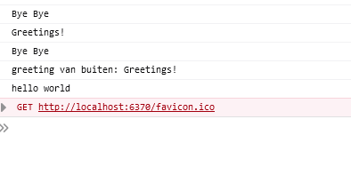
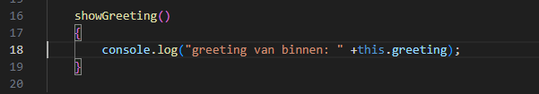
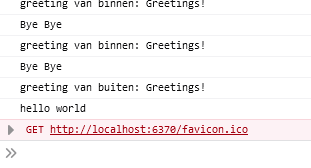
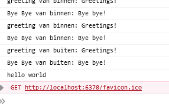

## Class eigenschappen

> Een `class` is een `ding` wat iets probeert voor te stellen. Een verzameling van dingen die bij elkaar horen  
> Voor eigenschappen denk bijvoorbeeld aan een `Player class`:
> - die heeft een positie op het scherm
> - die heeft misschien een inventory
> - die heeft misschien experience points
> - die heeft misschien aanvallen 
> 
> Naast `eigenschappen` heeft zo'n `class` ook `functionaliteii`. *wat kan je met het ding?*
> Het player voorbeeld:
> - een player kan naar voren bewegen
> - een player kan misschien springen
> - een player kan een aanval starten
> 
> Samen vormen die `eigenschappen` en `functionaliteit` een ding

## Constructor

In javascript geef je een class eigenschappen in de constructor.
We gaan even verder met de `Greet` class:
- die heeft een greeting.

> je maakt een eigenschap met het volgende patroon:
> - `this.naamVanDeEigenschap = waarde van de eigenschap`

- verander je `Greet` class naar:
 

> nu heeft je class een eigenschap `greeting`:
> deze kan je opvragen:
> - binnen de class (`this.greeting`)
> - buiten de class (`greet.greeting`)

### buiten de class:

- neem deze code over (buiten de class)
 

- test je code en kijk of je dit krijgt:
 

### binnen de class:

- ga naar je function `showGreeting`
- zorg dat die er nu zo uitziet:

 

- test je code en kijk of je dit krijgt:
 

## Nu GoodBye

- Doe hetzelfde voor de `GoodBye` class
    - zorg dat de eigenschap `farewell` heet niet `greeting` 

- test je code en kijk of je dit krijgt:
 

# Klaar?
Commit en push je werk naar github

