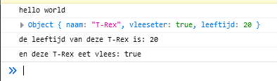

## Mappen aanmaken

- Ga naar waar jouw school werk staat
- Ga naar de map/directory `M2 prog js`
- Maak een map `07 dinos`
- Open de `07 dinos` folder in visual studio code

## files opzetten

- Kopieer files van de `01A` directory naar `07 dinos`
    - `index.html`
    - `app.js`

## opschonen

- zorg dat je app.js er zo uitziet:
    - je moet dus wat weghalen als je de opdrachten gemaakt hebt

 

## class aanmaken

we gaan nu class aanmaken, voor nu nog in `app.js` (later mag dat niet meer)
- type het volgende over:

 

- maak nu een nieuwe Dino:
 

## constructor gebruiken

> de constructor is een function die `1` keer afgaat, direct na de `new Dino()`
> - zie je die `Dino()` dat lijkt op een `function`, dat is de `constructor`
> - als de `constructor` 3 `argumenten` heeft moet de `new Dino()` ook `3 dingen` tussen de haakjes `()` hebben:
> - new Dino(`"A","B",1`);

## Constructor

- bekijk even die `contructor`, weet je nog wat dat was? zo niet check de presentatie
- In de `constructor` gaan we de eigenschappen van de `dino` maken
    > - `this.naamVanDeEigenschap = waarde van de eigenschap`

- begin met de naam:
 

-  zie je dat we op 2 plekken aanpassingen maken?
-  maak nu nog meer `eigenschappen`:
    - `vleeseter`, een `bool`
    - `leeftijd`, een `nummer`

## Check: 

heeft jouw `constructor` nu 3 argumenten (denk aan functions!)?
    - naam
    - vleeseter
    - leeftijd
 

- test je code en kijk of je dit krijgt:
 

## constructor gebruiken

we hadden dit:

 

Dat werkt nu niet meer goed, omdat we niets tussen de haakjes hebben `()`
maak daar nu van:
- `new Dino("T-Rex",true,20);`

- nu gaan we de eigenschappen loggen:
 

- test je code en kijk of je dit krijgt:
 

# Klaar?
Commit en push je werk naar github

