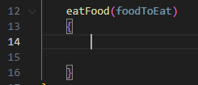
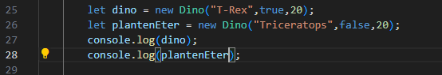
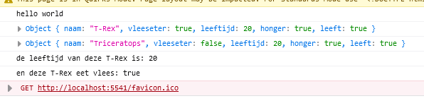
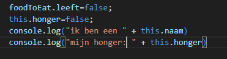
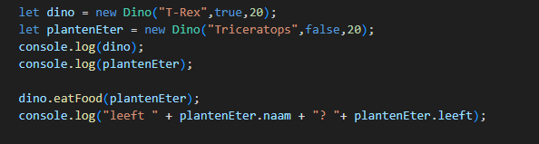
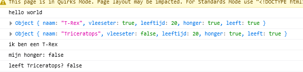

## Constructor uitbreiden

> HINT:
> - `this.naamVanDeEigenschap = waarde van de eigenschap`

-  maak nu nog meer `eigenschappen` vor `Dino`:

    - `leeft`, een `bool`
        - deze zet je altijd op `true`.
        - hij komt niet als `argument` in de constructor`()`
    - `honger` een bool
        - deze zet je altijd op `true`.
        - hij komt niet als `argument` in de constructor`()`

## TRex HUNGERS!

- geef de `Dino` class een nieuwe `function`:
    - de naam wordt: `eatFood`
    - het argument wordt: `foodToEat`

## 2 dinos

- ga naar `runApplication` van de `class App`
- maak een tweede dino:

- test je code en kijk of je dit krijgt:
 

## TREX eat Dino

- zet het volgende in de function body `{}` van `eatFood`:

- ga naar `runApplication` van de `class App`
- laat trex de triceratops eten:

- test je code en kijk of je dit krijgt:
 

> dus nu geven we een hele Dino door aan de function `eatFood`
> - in `food` zit dan een `Dino` als waarde
> - en die `Dino` heeft `eigenschappen` (en is de `triceratops`)
> - omdat we de function `eatFood` aan `dino` vragen (de trex)
>   - is binnen de function `this` de `trex`

# Klaar?
Commit en push je werk naar github

