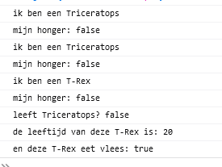
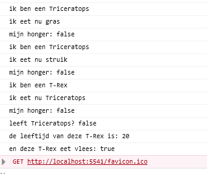

## Plant maken

we gaan nu een `Plant` class maken:
- noem de class `Plant`
- geef `Plant` een `constructor`
        > HINT *kijk naar de andere classes*
- geef de `Plant` de `eigenschappen`:
    - naam
    - leeft
        > HINT `this.naamVanDeEigenschap = waarde van de eigenschap`

## Plantjes maken

- ga naar `runApplication` van de `class App`
- maak 2 planten aan met `new Plant`:
    - gras
    - struik

## eatFood?

> in javascript zou je nu een `Plant` ook aan `eatFood` kunnen meegeven
> - maar is een `Dino` een `Plant`? nee, maar voor javascript maakt dat niet uit
> - zolang ze alletwee maar de eigenschap `leeft` hebben

-  zorg dat `plantenEter` (de triceratops):
    - gras eet
    - struik eet
> - HINT doe dit voor dat de triceratops wordt opgegeten

    

- test je code en kijk of je dit krijgt:
 

## Wat eet je dan?

> dat is niet heel duidelijk, we zien niet wat gegeten wordt

- in de function `eatFood` zetten we nu een console.log erbij:
 

- test je code en kijk of je dit krijgt:
 

> hier hebben we nu van het argument `foodToEat` een eigenschap opgevraagd:
> - `foodToEat.naam`
> - zo kunnen we zowel de eigenschappen van:
    - de triceratops (of trex) [`this` ] veranderen
    - of die van `foodToEat`
> - `this` wijst dus naar de `HUIDIGE` instantie *new* van de class

# Klaar?
Commit en push je werk naar github

