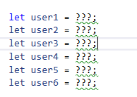
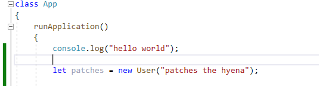

## Mappen aanmaken

- Ga naar waar jouw school werk staat
- Ga naar de map/directory `M2 prog js`
- Maak een map `07 this`
- Open de `07 this` folder in visual studio code


## files opzetten

- Kopieer files van de `01A` directory naar `07 this`
    - `index.html`
    - `app.js`

## opschonen

- zorg dat je app.js er zo uitziet:
    - je moet dus wat weghalen als je de opdrachten gemaakt hebt

</br>

## User class maken

we gaan nu een `User` class maken:
- noem de class `User`
- geef `User` een constructor:
    - `constructor(name)`
- geef de `User` de `eigenschappen`:
    - name
        > HINT `this.naamVanDeEigenschap = waarde van de eigenschap`
        
## Users maken

- Verzin 6 user names

- ga naar `runApplication` van de `class App`
- zet deze code erin:
</br>
- maak 6 Users aan met `new User`  (vervang de `???`) 
    - voorbeeld:
    </br>

## WieBenIk?

- Maak in `User` een `function`:
    - met de naam `wieBenIk`
    - in de `body` (`{}`) zet je:
        - `console.log(this.name)`

> voor patches krijg je dan:
>  </br>
> de `this` in `wieBenIk` wijst naar:
> - de instance van User
> - met `patches the hyena` in de `name`
>   - Dus deze let patches:    
>    </br>


## Commentaar

- neem deze code over
    </br>
- schrijf met commentaar:
    - wat er in `this.name` zit
    - welke user `this` is.
        - HINT: `dit veranderd per regel!` dit is afhankelijk van `aan wie` je vraag wie hij is
```js 
patches.wieBenIk();//dit is commentaar
```

## Testen

- test nu je code.
- schrijf er bij welke jij (met commentaar):
  - goed had
  - fout had
 
# Klaar?
Commit en push je werk naar github

