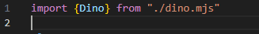

# Opdrachten modules

## Mappen aanmaken

- Ga naar waar jouw school werk staat
- Ga naar de map/directory `M2 prog js`
- Maak een map `08 modules`
- Open de `08 modules` folder in visual studio code

## files opzetten

- Kopieer files van de `01A` directory naar `08 modules`
    - `index.html`
    - `app.js`
- maak een extra file aan:
    - `dino.mjs`

> de `mjs` staat voor `module javascript`, dit is om het duidelijk te maken welke javascript files `modules` zijn en welke `gewoon` javascript

## opschonen

- zorg dat je app.js er zo uitziet:
    - je moet dus wat weghalen als je de opdrachten gemaakt hebt

 

## dino

- kopieer je `dino` class uit `app.js` van opdracht `07 classes`
    - plak die in `dino.mjs` in de map `08 modules`
- zet voor je `class Dino` een `export`:
 

- importeer de dino class in `app.js`:
 

> die lijkt een beetje op wat je in blok 1 gebruikte met `readlineSync`  
> jij hebt nu je eigen `module` gemaakt die je dan overal kan `importeren`

## Gebruiken

- zet nu in `app.js` de volgende code:
 

- test je code en kijk of je dit krijgt:
 

## Plant

- maak nu van de `Plant class` van `07 classes` ook een module
    - dus maak een `.mjs` file en `export` je class
- importeer de `Plant` in je `app.js`
- maak met `new` in `app.js` een instantie
- schrijf de `naam` naar de `console`

- test je code en kijk of je dit krijgt:
 

> Zie je dat we nu meer files krijgen maar dat de files kleiner zijn?
> - zo wordt je code duidelijk
> - zo kan je je code makkelijk opdelen in kleine stukken
> - zo wordt je code makkelijker om te beheren

## klaar? 

- commit & push je werk naar github
