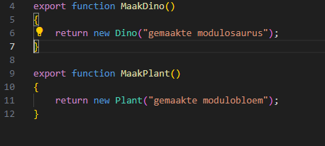
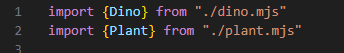
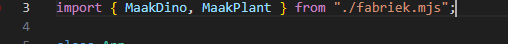
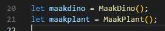
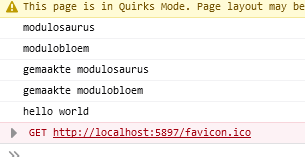

# Opdrachten modules

Stel we willen alleen functions importeren? Of meerdere dingen uit 1 module file.
Dat gaan we nu proberen.

## MaakDino function

- maak een nieuwe file:
    - `fabriek.mjs`
- zet daar de volgende functions in:
> let even op, zie je de exports? die zorgen ervoor dat je de functions kan gebruiken
>  

> Nu gebruiken we `Dino` en `Plant` in `fabriek`, MAAR fabriek kent die helemaal niet
> - we moeten `Dino` importeren
> - we moeten `Plant` importeren

- zet bovenin `fabrike.mjs`:
 

> nu kan je fabriek werken

## Gebruiken

- zet nu in `app.js` de volgende code:
 

> nu kan je `MaakDino` en `MaakPlant` gebruiken

- Doe dat, gebruik deze code:
 
- `console.log` de naam van de nieuwe plant en dino

- test je code en kijk of je dit krijgt:
 

## klaar? 

- commit & push je werk naar github
