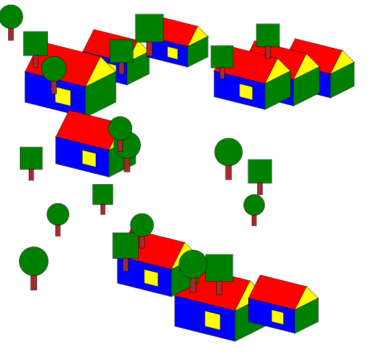

# Opdrachten modules

## Mappen aanmaken

- Ga naar waar jouw school werk staat
- Ga naar de map/directory `M2 prog js`
- Maak een map `08 modules canvas`
- Open de `08 modules canvas` folder in visual studio code

## files opzetten

- Kopieer files van het `04 canvasfunc` naar `08 modules canvas`
    - `index.html`
    - `app.js`
    
- controlleer of je `functions` hebt gemaakt in `app.js`:
    - `tekenHuis`
    - `tekenBoom`. 
        - Niet? moet je die maken (zie de les opdrachten van `functions`)

## javascript 

we gaan nu ons `huis render code` de `boom render code` naar `aparte` files verhuizen

- maak met visual studio code 2 nieuwe files aan:

    - `HuisRenderer.mjs`
        - maak hierin een nieuwe `class` HuisRenderer
    - `BoomRenderer.mjs`
        - maak hierin een nieuwe `class` BoomRenderer

- verhuis nu de `tekenHuis` en `tekenBoom` naar de renderers.

- nu werkt je app niet meer. Want we moeten importeren:
    > `import {WAT} from "./WELKEFILE.js"`
- importeer beide render classes in `app.js`
- gebruik nu je render classes waar je `tekenHuis` en `tekenBoom` gebruikt
    > HINT: maak een `new` van de renderen, dan `call` je de `render` function
    > - `let huisRenderer = new HuisRenderer();`

## andere bomen

we gaan BoomRenderer aanpassen:
- maak in `BoomRenderer.js` een nieuwe `class` aan en noem deze `BoomVariantRenderer`
- maak in `BoomVariantRenderer` een function `tekenBoom` 
- in `tekenBoom` laat je een andere boom tekenen (bijvoorbeeld een vierkante)
- gebruik nu in je `App.js` ook `BoomVariantRenderer` om nog een boom te tekenen (deze ziet er dus anders uit)

> TIP! nu moet je dus beide classes (`BoomRenderer` en `BoomVariantRenderer`) importeren

## random & for

- probeer nu met een `for loop` en een `Math.random()` de huizen en bomen te plaatsen

Het resultaat als je wat meer laat tekenen:

## Extra:

heb je nog meer dingen in je dorp gezet? Bv een slee, kerstman of een sneeuwpop
- maak daar ook renderers voor!
- Zijn er nog andere dingen waarvoor je classes in aparte files kan maken? probeer het!

## klaar?

- commit & push je werk naar github
