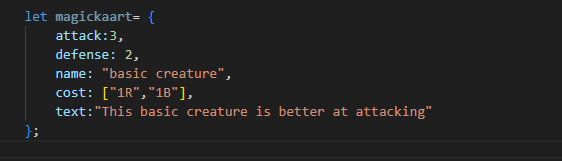
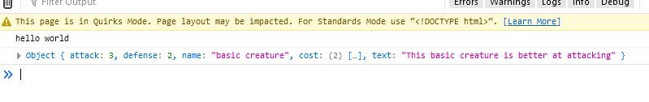
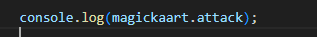
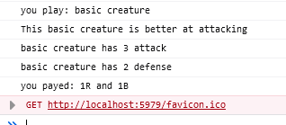

# javascript object notation

We hebben nu `classes` gemaakt. Dat is een nette manier om je code op te delen.
Als we met javascript bezig zijn om bijvoorbeeld `data` van een `server` te halen gebruiken we vaak `objecten`.
Dat wordt met het `JSON` formaat verstuurd.
- `Objecten` lijken een beetje op `classes`
- gebruik deze vooral om `data` over het `netwerk` te sturen

## Mappen aanmaken

- Ga naar waar jouw school werk staat
- Ga naar de map/directory `M2 prog js`
- Maak een map `09 objecten`
- Open de `09 objecten` folder in visual studio code

## files opzetten

- Kopieer files van de `01A` directory naar `09 objecten`
    - `index.html`
    - `app.js`

## opschonen

- zorg dat je `app.js` er zo uitziet:
    - je moet dus wat weghalen als je de opdrachten gemaakt hebt

 

## object maken

we gaan nu zelf een object maken:

- ga naar `runApplication` in `app.js`
- neem de volgende code over:
 

- `console.log` nu `magickaart`
- test je code en kijk of je dit krijgt:

 

> Zie je ook dat `cost` een array is?
>  
> `cost` is `2 lang`, en heeft de volgende items in zich:
>   - "1R" een string
>   - "1B" een string

## eigenschappen

> een object heeft eigenschappen, net als een `class`
> - deze eigenschappen kan je opvragen met het patroon:
>   - `variablename`.`eigenschapname`
>   - voorbeeld:
>   

- gebruik `console.log` om het volgende in de console te krijgen:
 

## klaar? 

- commit & push je werk naar github

