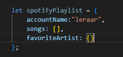
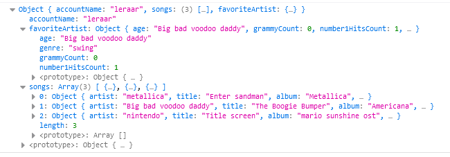
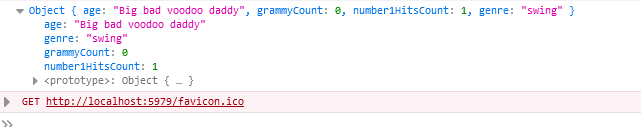
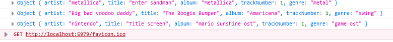

# javascript object notation

Een object kan als eigenschap een ander object hebben. Net als classes
Laten we dat gaan proberen

## Spotify playlist

- ga naar `runApplication` in `app.js`
- neem deze code over:
 

> zie je de `songs`? dat is een `array`!
> zie je de `favoriteArtist`? dat is een object `{}`

## My Fav!

- vul nu favoriteArtist in
    > - werk tussen de `{}` van favoriteArtist
- geef favoriteArtist de eigenschappen:
    - artistName
    - age
    - grammyCount
    - number1HitsCount
    - genre

## songs toevoegen

- voeg 3 songs toe aan je playlist:
    > - werk tussen de `[]`
    - maak van elke song een object, dus schrijf eerst `{}`
    > daarna werk je tussen de `{}`
- een song heeft de volgende eigenschappen:
    - artist
    - title
    - album
    - trackNumber
    - genre

## console.log

- `console.log` nu je playlist
- test je code of je dit krijgt: (met andere liedjes)
 

## Alleen de artist?

- probeer van je playlist nu alleen de `favoriteArtist` te loggen:
 

## songs 1 voor 1?

- probeer van je playlist nu alle songs 1 voor 1 te loggen:
> hint gebruik een `for` loop
 

## klaar? 

- commit & push je werk naar github

