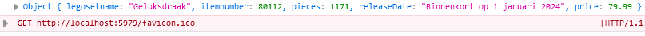

# javascript object notation

nu hebben we objecten.
Wat vaak gebeurt is dat `data` (zoals die van spotify) uit een `API` komt.
Dat is een `server` met een `programma` dat `data` ontvangt en verstuurt. Meestal zit er een `database` achter.

Voorbeeld van een website met een API:
- discord


## Data klaar maken voor versturen


> we kunnen niet zomaar data in javascript naar iets toesturen. Die data staat in het geheugen van onze PC
> - we zetten die data om naar iets wat verstuurt kan worden
> - dat noemen we `serialisation`. Met json gebruiken we de function `stringify` om dat te doen


- ga naar `runApplication` in `app.js`
    - controlleer of je daar:
        - je spotify playlist hebt
        - je magickaart hebt
- neem deze code over:

</br>

- test je code en kijk of je krijgt:
</br>

> - Dus eerst gebruiken we `console.log` om magickaart te loggen
> - daarna loggen we de `string` die we van `JSON.stringify` terug krijgen  
>      - `strings` kunnen we makkelijk versturen via een `netwerk`

## Spotify

- doe nu hetzelfde voor spotify

- test je code en kijk of je krijgt:
</br>


## En weer terug?

- neem de volgende code over:
```js
 let coolJson = '{"legosetname":"Geluksdraak","itemnumber":80112,"pieces":1171,"releaseDate":"Binnenkort op 1 januari 2024","price":79.99}';
        
```
- gebruik nu de `JSON.parse()` function:
</br>

- test je code en kijk of je krijgt:
</br>

## eigenschappen

- `console.log` nu alle eigenschappen van de legoset 1 voor 1:
</br>

## klaar? 

- commit & push je werk naar github


