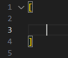
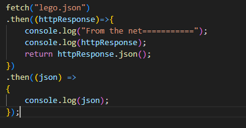
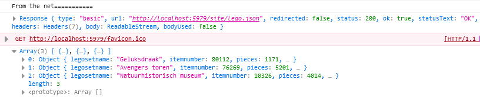

# javascript object notation

Omdat we nu geen API gaan bouwen, dat is iets wat later komt, gaan we een json bestand ophalen


## File maken

- maak een nieuwe file aan:
    - `lego.json`
- zet daar het volgende in:
</br>
> dit is dus een array, daar kunnen meerdere objecten in:
 ```js
 [
 {},
 {},
 {},
 ]
 ```

- gebruik nu de code hieronder om een set in de array te zetten `[]`:
```js
 {"legosetname":"Geluksdraak","itemnumber":80112,"pieces":1171,"releaseDate":"Binnenkort op 1 januari 2024","price":79.99};
        
```

- ga naar https://www.lego.com/nl-nl/categories/new-sets-and-products
    - kies nog `2` sets uit
    - zet die ook in de `json file` in de `array`

## ophalen en loggen

> we gaan nu fetch gebruiken om de json op te halen

- neem de volgende code over:
</br>


- test je code en kijk of je krijgt:
</br>


## klaar? 

- commit & push je werk naar github


