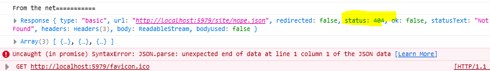
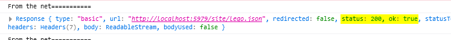
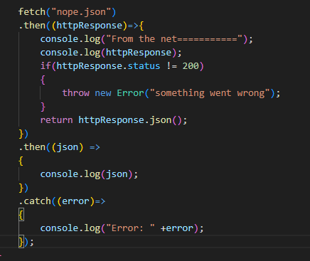
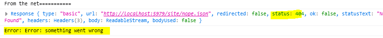

# javascript object notation

> Als je iets online ophaalt... dat kan fout gaan
> daar moeten we wat mee doen

## Fout!

laten we testen wat er dan gebeurt!

- zet nog een keer deze code in je `app.js`:
 
- verander `lego.json` naar `nope.json`

- test je code en kijk of je krijgt:
 

> zie je die `404` staan bij `status`?
> - dat is een http status code, die geeft aan wat er aan de hand is
> - een 200 is bijvoorbeeld `ok`
>  
> - Bij een `404` krijgen we geen `file` binnen en dan gaat ` return httpResponse.json();` fout

## Rekening houden met fouten

- verander je fetch code:
 

- test je code en kijk wat er nu gebeurt:
 

> nu krijgen we een nette fout, en crashen we niet meer.  
> dat is beter! 

## klaar? 

- commit & push je werk naar github

