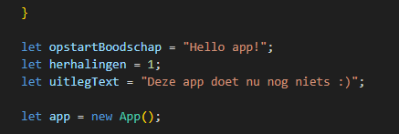
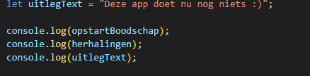
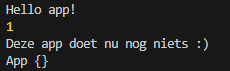

## variabelen

- open `app.js` in `variabeloefeningen`
 

## globale variabel

 
- kijk naar de start code hierboven
> zie je die `let app = new App();`? 
> - `let app` is de `variabel`  
> - een `variable` is een ding waar het programma `data` in bij kan houden  
> - de `=` geeft aan dat we een `waarde` geven aan wat er `links` van de `=` staat  
> `new App();` is de `waarde` die we bijhouden in `let app`
> - deze `variabel` kan je `overal` gebruiken (`global`) 
>   - *NA* regel 6 (daarvoor bestaat `de variable` nog niet)

## variabelen maken

- zet nu boven `let app` (regel 5) nieuwe variabelen:
 

> - nu hebben we dus 3 `variabelen` gemaakt.
> - deze staan nu in het `geheugen` van de computer
> - we kunnen de waarden `veranderen` in het `geheugen`
> - of we kunnen de waarden `ophalen` uit het `geheugen` 

## ophalen

Waarden die we hebben opgeslagen moeten we vaak ook gebruiken.
> denk aan een `contact` van jou `ophalen` om die een `bericht te sturen`

- schrijf de volgende code over:  
 

- kijk naar `console.log(opstartBoodschap)`
> - `console.log()` is een `function`, waar je 1 ding aan `meegeeft` om te loggen 
> - wij halen de waarde van `opstartBoodschap` op
> - dat wordt `Hello app!` een `string`  
> - die geven we mee aan de `console.log()` function

## testen

- gebruik `nodejs` om `app.js` te draaien
- dit zou je moeten zien:  
 

## klaar?

- commit & push je werk naar github
